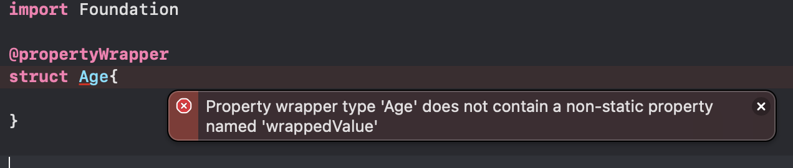
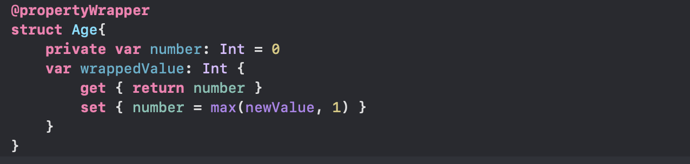
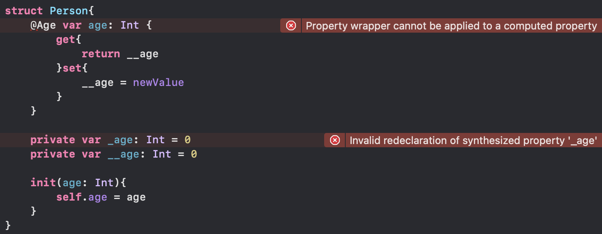

# Property Wrappers

> 정의 : A property wrapper adds a layer of separation between code that manages how a property is stored and the code that defines. a property.

* '프로퍼티가 어떻게 저장되는지 관리' 하는것과 '프로퍼티의 정의 사이'에 '분리계층'을 추가합니다.

- *~~무슨소리구?? 분리계층??~~ 정의만 봐서는 느낌상.. Computed Properties와 같은것 아닌가?*

> When you use a property wrapper, you write the management code once when you define the wrapper, and then reuse that management code by applying it to multiple properties.

* 프로퍼티 래퍼를 사용 할 때, 래퍼를 정의하면서 관리 코드를 한번 쓰고는 여러가지 프로퍼티들에 재사용 합니다.

- *get/set은 프로퍼티가 가지는 것인데.. 프로퍼티 래퍼는 프로퍼티에 부여한다? 다른것같은데? 아니 다르지.*

### Example

* property wrapper 정의시 필수 프로퍼티 wrappedValue를 정의하였습니다. 나이라는 property Wrapper를 만들었으며, 나이는 입력 시 0이하라면 1로 입력 됩니다.

* property wrapper에 의해 정의된 Age로 age property를 가진 Person 구조체를 작성하고, 'song'이라는 Person을 age -1로 생성합니다. 이후, song의 age에 1로 저장되어있는것을 확인 할 수 있습니다.

### 재미

* property wrapper를 사용하면 내부적으로 property명 앞에 '_'을 붙여서 내부적으로 computed property를 만들어 사용하는걸까?